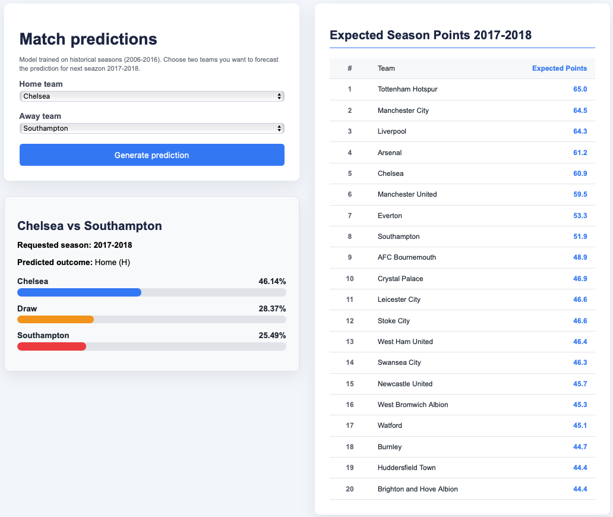

# Football Match Prediction



## Project Description

This project implements an advanced football match result prediction system using Machine Learning algorithms (XGBoost). The system analyzes historical data from multiple seasons to learn patterns and predict future match outcomes with high accuracy.

### How Accuracy Works

The model improves its accuracy by training on data from **multiple consecutive years** (2008-2017), using a sophisticated approach:

**1. Multi-Season Data Training**
- The model is trained on historical data from 9 consecutive seasons (2008-2017)
- For each match, it uses team statistics from the **previous season**
- Learns from over thousands of real matches to identify complex patterns

**2. Temporal Weighting System**
- More recent matches receive higher weight (exponential decay)
- Older seasons have less influence on the model
- Ensures data relevance for current football conditions

**3. Complex Extracted Features**
- **Home/Away Statistics**: Team performance at home vs away
- **Head-to-Head**: Direct history between teams
- **Recent Form**: Evolution of team performances
- **Statistical Differences**: Comparisons between team indicators
- **Experience**: Adjustments for promoted/relegated teams

**4. Rigorous Validation and Testing**
- Testing on 2017-2018 season (completely separate from training)
- Cross-validation for hyperparameter optimization
- Multiple metrics: accuracy, precision, recall

**5. Optimized XGBoost Algorithm**
- Hyperparameter tuning through RandomizedSearchCV
- Regularization to prevent overfitting
- Automatic class balancing for unbiased predictions

### Results

The model provides for each match:
- **Prediction**: Most likely outcome (Home/Draw/Away)
- **Probabilities**: Percentage chances for each possible result
- **Expected Points**: Expected points for each team in the season

---

## Usage

### 1. Environment Setup

**Required dependencies:**
- pandas: data processing and manipulation
- numpy: numerical calculations
- scikit-learn: metrics and validation
- xgboost: prediction algorithm
- Flask: web application

---

### 2. Model Training

Before making predictions, you need to train the model on historical data:

```bash
python train_model.py
```

**What the training script does:**
- Loads data from all seasons (2008-2017)
- Extracts complex features for each match
- Applies temporal and experience weights
- Trains XGBoost model with hyperparameter optimization
- Generates detailed performance report

---

### 3. Predictions via CLI

After you have the trained model, you can make predictions directly from the terminal.

#### Prediction for a single match:

```bash
python predict.py "Manchester United" "Liverpool"
```

**Output:**
- Predicted result (Home/Draw/Away)
- Probabilities for each result

#### Generate predictions for all possible matches:

```bash
python predict.py --all
```

**What the `--all` command does:**
- Generates predictions for ALL possible match combinations
- Based on teams from the 2017-2018 season
- Calculates expected points for each team
- Saves results in the `output/` directory:
  - `all_matches_2017_2018.csv` - All matches with predictions
  - `expected_points_2017_2018.csv` - Rankings with expected points

**CLI Parameters:**
- `<home_team>` - Home team name
- `<away_team>` - Away team name
- `--all` - Flag for complete generation

**Examples:**
```bash
# Specific match
python predict.py "Chelsea" "Arsenal"
python predict.py "Real Madrid" "Barcelona"

# All matches
python predict.py --all
```

---

### 4. Web Application

The web application provides a user-friendly graphical interface for predictions.

#### Web Features:

**1. Prediction Interface**
- **Team Selection**: Dropdowns with all available teams
- **Season Selection**: Ability to select desired season
- **Instant Prediction**: Button for real-time prediction calculation
- **Detailed Results**:
  - Predicted result (Home/Draw/Away)
  - Visual probabilities for each result
  - Intuitive charts for understanding predictions

**2. Expected Points Rankings**
- Interactive table with expected points for all teams
- Automatic sorting by points
- Top teams visualization
- Based on all possible matches in the season

**3. Validation and Errors**
- Automatic verification: teams must be different
- Clear and informative error messages
- Input validation for correct data

**4. Modern Design**
- Responsive interface
- Modern styling with custom CSS
- Optimized UX experience

#### Web Technology:
- **Backend**: Flask (Python)
- **Frontend**: HTML, CSS
- **Template Engine**: Jinja2
- **Data Loading**: Pandas for processing

---

## Project Structure

```
Football-Prediction/
├── app.py                          # Flask web application
├── predict.py                      # CLI predictions script
├── train_model.py                  # Model training script
├── requirements.txt                # Python dependencies
├── Dockerfile                      # Docker container
├── model_final.pkl                 # Trained model (generated)
├── feature_columns.pkl             # Model features (generated)
│
├── databases/                      # Data for training and predictions
│   ├── results.csv                 # Match results 2008-2017
│   ├── stats.csv                   # Team statistics per season
│   ├── 2017-2018.csv              # Test data season 2017-2018
│   └── ...                        # Other auxiliary files
│
├── output/                         # Generated results
│   ├── all_matches_2017_2018.csv  # All generated predictions
│   └── expected_points_2017_2018.csv  # Expected points rankings
│
├── static/                         # Static web files
│   └── css/
│       └── style.css              # Custom styles
│
└── templates/                      # HTML templates
    └── index.html                 # Main web page
```

---

## About Data

### Required Data

**1. results.csv**
- Actual match results from previous seasons
- Essential columns: home_team, away_team, result (H/D/A), season

**2. stats.csv**
- Aggregated statistics per team and season
- Includes: wins, draws, losses, goals, points, etc.
- Used for feature extraction

**3. 2017-2018.csv**
- Data for testing and validation
- Complete season separate from training

---

## Recommended Workflow

### For First Use:

1. **Installation**: `pip install -r requirements.txt`
2. **Training**: `python train_model.py`
3. **CLI Test**: `python predict.py "Team1" "Team2"`
4. **Start Web**: `python app.py`

### For Data Update:

1. Update CSV files in `databases/`
2. Re-train the model: `python train_model.py`
3. Regenerate predictions: `python predict.py --all`
4. Restart web application
